# Decomposing Actuator Thermal Dissipation in Learned Legged Locomotion: Posture, Ripple, and Closed-Loop Filtering Limits

*Draft v3 (author rewrite, 2026-09-10). Simulation only. No hardware results yet.*

Figures: `fig/` (vector, from `figsrc/*.py`) and `pic/` (original experiment plots) ·
v1 source draft: `paper-command-filtering-draft.md` · reading page: `index.html`

> **Status of the numbers.** Quantities come from the v1 source draft, which is authoritative
> wherever the drafts differ. Where v1's own tables and prose disagree, the table is used;
> Appendix B records every ruling and its basis. Quantities that exist in no draft, or that the
> text asserts without a source, are marked `pending` and listed in Appendix C. Nothing here has
> been inferred, interpolated, or reconstructed.

---

## Abstract

Reinforcement learning (RL) locomotion policies frequently drive legged actuators into thermal
shutdown through high-frequency command chattering. Mitigating this heating conventionally requires
tedious reward retuning, while post-hoc command filtering is widely avoided due to filter-induced
phase lag that degrades closed-loop stability margins. In this paper, we show that command-side
thermal dissipation can be safely resolved post-hoc on frozen checkpoints without retraining. We
demonstrate that electrical copper loss decomposes in quadrature into a steady-state posture term and
a dynamic ripple term, showing that jitter-induced heating is strictly governed by joint-specific
loading rather than intrinsic policy traits. On a Unitree Go1, an analytical crossover at 3.2 N·m
separates posture-dominated stance joints from jitter-dominated hip joints. We show that
zero-order-hold discretization harmonics contribute negligibly (1.6%), with discretionary losses
concentrated in 5–25 Hz in-band jitter. To bypass the catastrophic falls caused by filter lag at
operating speeds, we introduce an order-8 predictive linear filter with joint-load gating. This
plug-and-play architecture recovers 47–54% of the reachable thermal budget across regularized and
unregularized policies without inducing falls.

**Index terms** — legged locomotion, reinforcement learning, actuator thermal load, copper loss,
command smoothing, zero-order hold, spectral decomposition, closed-loop stability.

---

## 1. Introduction

Legged locomotion policies trained via deep reinforcement learning (RL) routinely push actuator
thermal limits, often triggering shutdowns in regimes where classical controllers operate safely: a G1
ankle roll reaches 90 °C where the vendor controller holds it below 45 °C,[1] while on a Go2-W it is
the learned policy that stays thermally safe.[4] While policy behavior unquestionably dictates motor
heating, the underlying mechanism remains contentious: the **posture hypothesis** attributes
overheating to inefficient steady-state holding torques, whereas the **jitter hypothesis** blames
discrete high-frequency setpoint oscillations.

We show that both mechanisms are physically coupled in quadrature. Because motor copper loss scales
with squared torque, partitioning torque into its mean and zero-mean fluctuations yields

$$
\mathcal{H} \;\propto\; \mathbb{E}[\tau^2] \;=\; \bar{\tau}^2 \;+\; \mathrm{Var}(\tau) .
$$

Consequently, large steady-state loads mathematically suppress the relative impact of command variance
$\mathrm{Var}(\tau)$. Whether command jitter governs dissipation is therefore dictated by
joint-specific loading: stance joints are posture-dominated, whereas lightly loaded joints are
jitter-dominated.

Addressing this dissipation post-hoc on frozen checkpoints introduces a fundamental control dilemma.
Standard low-pass filtering injects phase lag into the active feedback path, eroding stability margins
and precipitating falls at operating speeds. In this work, we resolve this conflict by establishing
the closed-loop stability limits of command filtering and proposing a predictive, load-gated framework
that safely recovers actuator thermal margins without policy retraining.

### Contributions

- **C1. Spectral and quadrature heat decomposition.** We formulate an exact Parseval-based
  decomposition isolating copper loss into static posture, gait fundamentals (0–5 Hz), in-band jitter
  (5–25 Hz), and zero-order-hold (ZOH) harmonics (> 25 Hz). We identify an analytical crossover at
  $\bar{\tau} \approx \sqrt{\mathrm{Var}(\tau)} \approx 3.2$ N·m on a Unitree Go1, revealing that ZOH
  harmonics contribute merely 1.6% and establishing which joints are physically amenable to filtering.
- **C2. Closed-loop latency failure boundary.** We quantify the divergence between open-loop replay,
  with up to 46% apparent savings, and closed-loop execution, demonstrating that 40 ms of filter
  latency induces up to a 100% fall rate at operating speed (1.0 m/s).
- **C3. Retraining-free predictive gated filtering.** We propose an AR(8) predictive compensator paired
  with joint-load gating that eliminates phase lag, safely recovering 47–54% of the reachable thermal
  budget across diverse checkpoints without retraining or stability loss.
- **C4. Regularization diagnostics.** Over five training seeds we show that conventional `action_rate`
  penalties exert no measurable authority over command-side thermal load: ablating them moves step
  transients by $+5\% \pm 6$, an interval that straddles zero. Ablating direct effort penalties moves
  them by $+74\% \pm 23$, positive in every seed.

---

## 2. Actuation Pipeline and Problem Formulation

Commercial quadruped and humanoid architectures execute proportional-derivative (PD) tracking loops on
distributed motor drives rather than within the policy loop. As illustrated in Fig. 1, the policy emits
joint position targets $q^*$ at frequency $f_{\text{pol}}$. These setpoints cross a communication bus
to motor-side PD loops running at a substantially higher frequency. In Unitree systems, the policy
executes at $f_{\text{pol}} = 50$ Hz while low-level commands are written at 500 Hz;[62] DeepRobotics
Lite3 platforms run a 1 kHz state loop.[63] Vendor datasheets place the actuator-side communication
control frequency higher still: 6 kHz for the Unitree GO-M8010-6[6] and 1 kHz for the DeepRobotics
J60.[61]

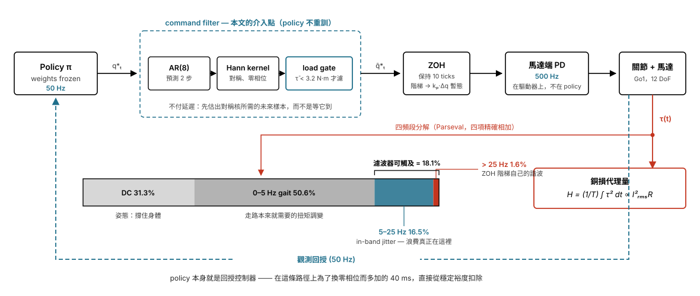

A zero-order hold (ZOH) sits at the interface between the high-level policy and low-level drive.
Operating at 50 Hz into 500 Hz, each setpoint is held constant across ten sub-ticks before stepping
discontinuously, producing an instantaneous proportional transient of $k_p \Delta q$ prior to
mechanical rotor acceleration.

In standardized training environments such as `unitree_rl_mjlab`, PD gains are tuned for a target
closed-loop natural frequency of $f_n = 10$ Hz with a damping ratio $\zeta = 2.0$, and action scaling
is normalized to $0.25\,e/k_p$, where $e$ is the actuator effort limit. Consequently, an action
reversal between successive policy steps commands a peak transient:

$$
\tau_{\text{step}} \;=\; k_p \cdot 2 \cdot \frac{0.25\,e}{k_p} \;=\; 0.5\,e .
$$

A full-scale command reversal thus demands an instantaneous torque transient equivalent to half of the
joint's peak effort capacity. With $\zeta = 2.0$, the dominant closed-loop pole sits at 2.68 Hz, yet
the 50 Hz command stream transmits spectral content up to its 25 Hz Nyquist boundary. The energetic
consequences of this frequency mismatch constitute the core focus of this study.

---

## 3. Metrics and Analytical Framework

### 3.1 Spectral heat decomposition

By applying Parseval's theorem to joint torque partitioned into steady-state and fluctuating
components, total expected dissipation is expressed as:

$$
\mathbb{E}[\tau^2] \;=\; \bar{\tau}^2 \;+\; \int_{0}^{f_g} S_\tau(f)\,\mathrm{d}f \;+\; \int_{f_g}^{f_{\text{Nyq}}} S_\tau(f)\,\mathrm{d}f \;+\; \mathbb{E}_k\!\left[\mathrm{Var}_{\text{sub}}(\tau)\right] ,
$$

where $f_g = 5$ Hz isolates fundamental gait frequencies, $f_{\text{Nyq}} = 25$ Hz is the policy
Nyquist frequency, and $\mathbb{E}_k[\mathrm{Var}_{\text{sub}}(\tau)]$ represents the intra-step
variance above Nyquist caused by ZOH discretization. The sum of the final two terms defines the
**reachable thermal budget**: the strict theoretical upper bound of dissipation that any command-stream
filter can influence.

### 3.2 Ripple fraction and out-of-band power

When full power spectral density data is unavailable, joint torque fluctuation is quantified via the
joint-level ripple fraction:

$$
r \;=\; \frac{\mathrm{Var}(\tau)}{\bar{\tau}^2 + \mathrm{Var}(\tau)} .
$$

Independent of plant dynamics, command-side roughness is characterized by the out-of-band command power
fraction:

$$
\rho \;=\; \frac{\int_{f_c}^{f_{\text{Nyq}}} S_q(f)\,\mathrm{d}f}{\int_{0}^{f_{\text{Nyq}}} S_q(f)\,\mathrm{d}f} ,
$$

where $f_c$ is the joint's $-3$ dB closed-loop bandwidth, 15.3 Hz for the Unitree Go1 model. A coarser
metric evaluated at 5 Hz, denoted $\rho_{>5\,\mathrm{Hz}}$, is also used to track broadband
high-frequency content. The two are different cuts and are not interchangeable.

### 3.3 Thermal loss proxy

Motor thermal dissipation is quantified via the metric $\mathcal{H} = \frac{1}{T}\int_0^T
\tau^2\,\mathrm{d}t$, which is proportional to winding copper loss $I_{\text{rms}}^2 R$ under a
constant torque sensitivity $K_t$. Quadratic torque evaluation is physically validated by stator
thermal dynamics: on calibrated brushless actuators, the winding thermal time constant is 3.12 s,
compared to 777 s for the motor housing — a disparity factor of 249.[7] Because driver thermistors
exhibit significant thermal lag relative to winding junctions, current-based squared torque serves as
the primary ground-truth metric.[8]

---

## 4. Experimental Setup

Four experimental protocols are evaluated. The labels are those of the source draft; there is no E4, as
the label was never assigned.

- **E1 (single joint, synthetic signals).** A second-order joint model representative of the Unitree
  Go1 ($k_p = 35$, damping 0.5, rotor inertia 0.005 kg·m², $f_n = 13.3$ Hz, $\zeta = 0.60$, $-3$ dB
  bandwidth 15.3 Hz) is excited by a 2 Hz sinusoidal command injected with bandpass noise above
  bandwidth. Commands are sampled at 50 Hz, held via ZOH to 500 Hz, and integrated at 5 kHz. Static
  load torques are swept from 0 to 20 N·m.
- **E2 (recorded trajectories, open loop).** Trajectories logged from seven Go1 policies across reward
  ablations are replayed through the single-joint model under candidate filter configurations.
  Preserved motion is benchmarked against the ZOH trajectory low-passed at 5 Hz.
- **E3 (closed loop, full quadruped).** A frozen Go1 policy is executed in MuJoCo at a 50 Hz policy
  rate and 500 Hz physics rate, ten substeps per policy step, with the candidate filtering pipeline
  active inside the feedback loop. Ten 500-step episodes are evaluated at each of three velocity
  commands (0.5 m/s, 1.0 m/s, and 0.3 m/s with yaw rate) across matched seeds and observation noise,
  giving $n = 30$ per scheme.
- **E4 (spectral decomposition).** Identical to E3 under baseline ZOH over 30 rollouts. Mean torque per
  policy step is recorded at 50 Hz, with spectral cuts at 5 Hz and 25 Hz, and intra-step variance
  supplying the > 25 Hz component.

**Predictive compensator and load gate.** An order-8 linear autoregressive model, AR(8), is fitted via
least squares on baseline rollouts and rolled forward two steps. This formulation enables the
application of a symmetric Hann window without awaiting future samples, eliminating filter phase lag.
Joints whose mean absolute torque $|\bar{\tau}|$ falls below the 3.2 N·m threshold are filtered, whereas
heavily loaded joints pass through unmodified.

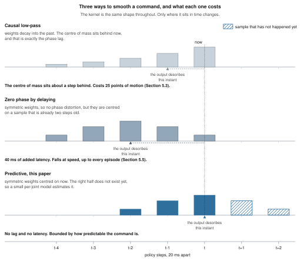

---

## 5. Results and Empirical Analysis

### 5.1 Load-dependent thermal crossover

Holding kinematic motion amplitude constant, the thermal penalty of out-of-band command power scales
inversely with static load.

| Static load | $\rho=0.02$ | $\rho=0.05$ | $\rho=0.10$ | $\rho=0.20$ | $\rho=0.40$ |
|---|---|---|---|---|---|
| 0 N·m | 1.81 | 3.08 | 5.38 | **10.86** | 27.30 |
| 2 N·m | 1.15 | 1.40 | 1.84 | 2.89 | 6.04 |
| 5 N·m | 1.03 | 1.08 | 1.16 | 1.36 | 1.96 |
| 10 N·m | 1.01 | 1.02 | 1.04 | 1.09 | 1.25 |
| 20 N·m | 1.00 | 1.00 | 1.01 | **1.02** | 1.06 |

*Table 1: Thermal dissipation relative to $\rho = 0$ across static load levels under single-joint
excitation (E1).*

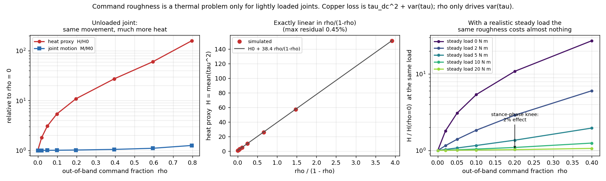

At $\rho = 0.20$, an unloaded joint dissipates 10.9 times the heat of an uncorrupted command while
altering joint motion by only 1.8%. In contrast, a joint supporting a 20 N·m static load exhibits
merely a 2% thermal increase under the same command roughness. Under unloaded conditions, dissipation
follows

$$
\mathcal{H} \;=\; \mathcal{H}_0 \;+\; \kappa\,\frac{\rho}{1-\rho}
$$

with $\kappa = 38.4$ and a maximum residual of 0.45%. The crossover where posture loss equals ripple
loss, $\bar{\tau}^2 = \mathrm{Var}(\tau)$, emerges at 3.2 N·m.

On the Unitree Go1, measured mean absolute joint torques $|\bar{\tau}|$ average 1.24–1.48 N·m for hip
abduction, 2.00–2.59 N·m for thighs, and 5.88–6.88 N·m for calves. Eight of the twelve joints operate
below the 3.2 N·m crossover, while the four knee actuators operate well above it. Consequently, posture
demands dominate knee dissipation, whereas jitter drives overheating in lightly loaded joints.

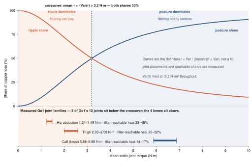

### 5.2 Effort terms govern jitter; action rate does not

Command-side statistics were evaluated across all seven ablated Go1 variants, each trained from five
random seeds at 60M timesteps, on 8 s rollouts (Appendix A.2). Table 2 reports mean $\pm$ standard
deviation across seeds. The final column is the change against **that seed's own baseline**, averaged
across seeds; pairing within a seed is what makes an interval on a relative change meaningful, because
the baseline itself varies by $\pm 0.12$ N·m between seeds.

| Policy variant | $\Delta q_{\text{rms}}$ (rad) | $\tau_{\text{step}}$ RMS (N·m) | Centroid (Hz) | $\rho_{>5\,\mathrm{Hz}}$ | vs. own baseline |
|---|---|---|---|---|---|
| Full reward baseline | 0.0702 ± 0.0034 | 2.46 ± 0.12 | 3.46 ± 0.34 | 0.105 ± 0.068 | — |
| No `orientation` | 0.0722 ± 0.0037 | 2.53 ± 0.13 | 3.60 ± 0.64 | 0.119 ± 0.110 | +3% ± 7 ns |
| No `feet_air_time` | 0.0708 ± 0.0024 | 2.48 ± 0.08 | 3.45 ± 0.23 | 0.113 ± 0.061 | +1% ± 7 ns |
| No `action_rate` | 0.0734 ± 0.0031 | 2.57 ± 0.11 | 3.39 ± 0.13 | 0.105 ± 0.052 | **+5% ± 6 ns** |
| No gait terms | 0.0803 ± 0.0053 | 2.81 ± 0.18 | 5.66 ± 0.86 | 0.202 ± 0.044 | +15% ± 8 |
| No `torques` + `energy` | 0.1216 ± 0.0116 | **4.26 ± 0.41** | 5.04 ± 1.16 | 0.332 ± 0.150 | **+74% ± 23** |
| Task terms only | 0.1612 ± 0.0073 | 5.64 ± 0.25 | 10.68 ± 0.24 | 0.886 ± 0.030 | +130% ± 18 |

*Table 2: Command-side spectral properties across reward ablations (E2), five seeds, mean $\pm$ s.d.
$\rho_{>5\,\mathrm{Hz}}$ is the coarse 5 Hz cut of §3.2, not the $-3$ dB-bandwidth $\rho$.
ns marks a paired interval that straddles zero.*

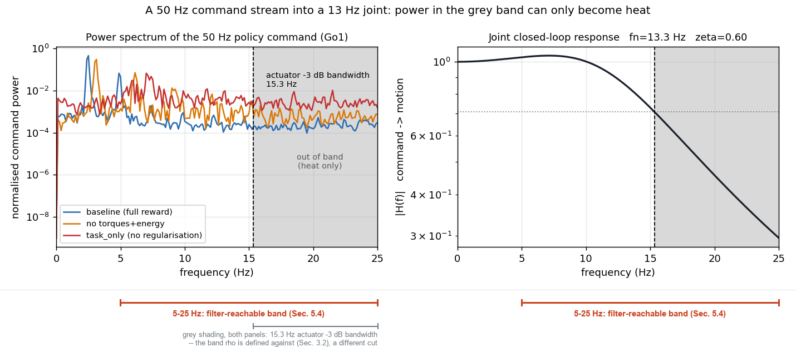

**Ablating `action_rate` produces no effect we can measure.** The paired change is $+5\% \pm 6$, an
interval containing zero, and in one seed of five the ablated policy is *smoother* than its own
baseline, so the ordering this section's title asserts fails outright there. An earlier single-seed
draft of this table reported $+8\%$; that was one draw from this distribution, not an effect.

**Ablating the effort terms produces a large one.** The paired change is $+74\% \pm 23$, positive in
every seed, and removing all shaping leaves $+130\% \pm 18$. Direct effort minimization, not discrete
action smoothing, is the primary regularizer of command-side thermal load.

The spread is not an artefact of unstable training. Final evaluation return across the five seeds is
tight for every variant (baseline $25.8 \pm 0.6$, no `torques`+`energy` $29.6 \pm 0.4$, task-only
$26.3 \pm 0.3$), so all 35 runs learned to walk; the variation in Table 2 is variation in *how* they
walk, not in *whether* they did.

Two cautions. The `no gait terms` variant at $+15\% \pm 8$ is the only one near the separability
boundary, and we do not lean on it. And $\rho_{>5\,\mathrm{Hz}}$ is far noisier across seeds than the
transient statistic — the baseline alone spans 0.105 ± 0.068 — so we read that column as descriptive
only and base no claim on its relative changes.

### 5.3 Open-loop filtering and the cost of phase lag

Replaying baseline trajectories through the unloaded single-joint model demonstrates the apparent
efficacy of open-loop smoothing.

| Filtering scheme | Heat $\mathcal{H}/\mathcal{H}_{\text{ZOH}}$ | Preserved motion | Deployable |
|---|---|---|---|
| Baseline ZOH | 1.000 | 1.000 | — |
| Linear interpolation | 0.696 | 0.819 | Yes |
| Causal Butterworth (12 Hz) | 0.588 | 0.745 | Yes |
| Predictive filter | **0.428** | 0.741 | Yes |
| Zero-phase Butterworth (12 Hz) | 0.540 | **0.995** | No |

*Table 3: Open-loop command replay through an unloaded joint model (E2).*

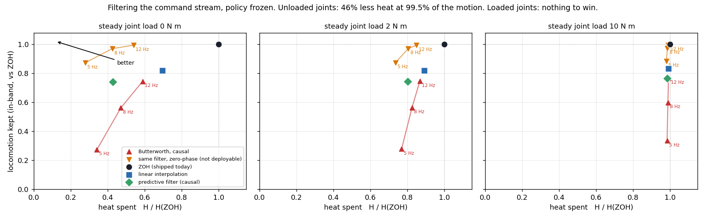

Zero-phase filtering achieves a 46% thermal reduction while preserving 99.5% of intended trajectory
motion. However, a causal implementation of the identical filter preserves only 74.5% of intended
motion due entirely to phase lag.

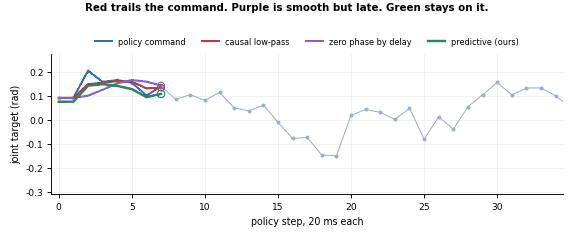

Out-of-sample *open-loop* command prediction accuracy reaches $R^2 = 0.679$ on the full-reward policy,
declining to 0.385 without effort terms, and collapsing to 0.059 on an unregularized checkpoint. A
separate predictor fitted for the closed-loop experiments reports different values; see §5.6 and
Appendix B, ruling B1.

### 5.4 Spectral allocation of the thermal budget

Exact Parseval decomposition across 30 closed-loop rollouts sets the theoretical ceiling for command
filtering.

| Band | Physical mechanism | Share of total heat |
|---|---|---|
| DC | Posture: static body support | 31.3% |
| 0–5 Hz | Gait: torque modulation walking requires | 50.6% |
| 5–25 Hz | In-band jitter: reachable by low-pass filtering | 16.5% |
| > 25 Hz | ZOH staircase harmonics: discretization artefacts | 1.6% |
| **Total reachable** | In-band jitter and staircase harmonics combined | **18.1%** |

*Table 4: Exact closed-loop torque spectral decomposition across 30 rollouts on the baseline Go1 policy
(E4). The four components sum to 255.9 against an independently computed heat proxy of 256.2, agreeing
to within 0.1%.*

The ZOH staircase — the explicit focus of interpolation literature — accounts for only 1.6% of motor
dissipation. Discretionary thermal waste resides primarily between 5 and 25 Hz.

| Joint family | Mean $|\bar{\tau}|$ (N·m) | DC | Gait (0–5 Hz) | 5–25 Hz | > 25 Hz | Reachable share |
|---|---|---|---|---|---|---|
| Hips | 1.2–1.5 | 7–21% | 47–54% | 33–45% | 0.3–0.4% | **33–45%** |
| Thighs | 2.0–2.6 | 2–19% | 56–78% | 16–29% | 3.0–4.0% | **20–32%** |
| Calves | 5.9–6.9 | 32–38% | 45–54% | 13–16% | 1.1–1.6% | **14–17%** |

*Table 5: Joint-specific torque budget decomposition (E4). Reachable share is the sum of the 5–25 Hz
and > 25 Hz columns.*

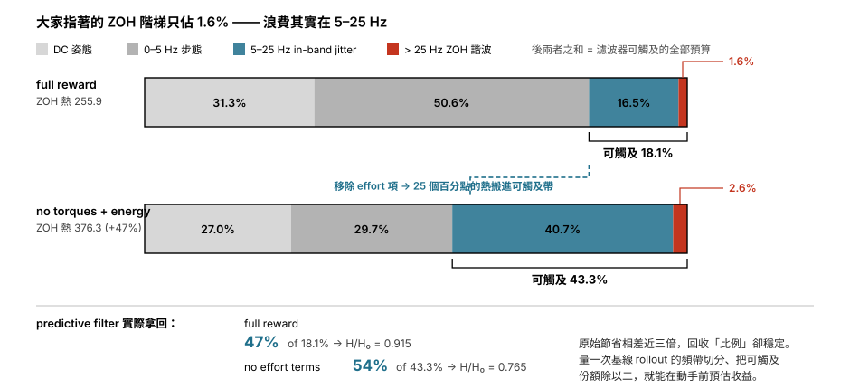

As predicted by §5.1, the reachable thermal budget scales inversely with joint holding load: lightly
loaded hip actuators exhibit reachable shares of 33–45%, while weight-bearing calf actuators remain
confined to 14–17%.

### 5.5 Closed-loop filtering: latency induces instability

When deployed inside the active feedback control loop, open-loop filtering gains evaporate due to phase
lag.

| Scheme | $\mathcal{H}/\mathcal{H}_{\text{ZOH}}$ | Tracking error | $\delta(H)$ | $\delta(\text{vel})$ | Fall rate |
|---|---|---|---|---|---|
| Baseline ZOH | 1.000 | 1.000 | 0.00 | 0.00 | 0.00 |
| Linear interpolation | 0.956 | 1.048 | −0.31 | 0.13 | 0.00 |
| Butterworth (5 Hz) | 1.098 | 2.594 | −0.04 | 1.00 | **0.23** |
| Butterworth (8 Hz) | 0.946 | 1.444 | −0.28 | 0.93 | 0.00 |
| Butterworth (12 Hz) | 0.935 | 1.160 | −0.28 | 0.52 | 0.00 |
| Butterworth (12 Hz) + linear | 0.942 | 1.284 | −0.26 | 0.75 | 0.00 |
| Zero-phase via 40 ms delay | **1.082** | 2.493 | −0.03 | 1.00 | **0.07** |
| Predictive filter | **0.915** | 1.279 | −0.33 | 0.71 | 0.00 |
| Predictive + joint gate | 0.940 | 1.157 | −0.33 | 0.50 | 0.00 |
| Predictive (policy-unaware) | 0.927 | 1.236 | −0.33 | 0.64 | 0.00 |

*Table 6: Full-body closed-loop locomotion performance ($n = 30$ per scheme, E3). Cliff's $\delta$ is
reported against ZOH.*

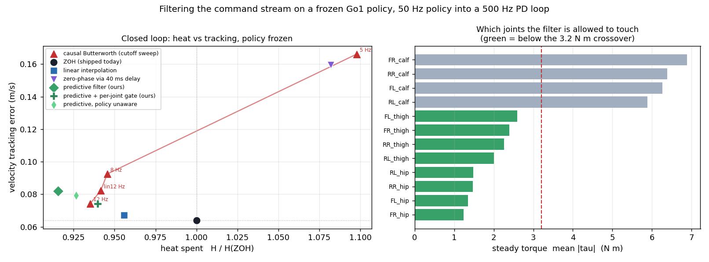

The predictive filter achieves an 8.5% total thermal reduction (Cliff's $\delta = -0.33$),
representing a 47% recovery of the 18.1% reachable budget. In contrast, linear interpolation recovers
only 4.4% of total heat.

| Scheme | > 25 Hz term (absolute) | Total $\mathcal{H}/\mathcal{H}_0$ |
|---|---|---|
| Baseline ZOH | 4.02 | 1.000 |
| Butterworth (5 Hz) | **1.96** | **1.098** |
| Zero-phase via 40 ms delay | **2.34** | **1.082** |
| Butterworth (12 Hz) | 2.93 | 0.935 |
| Predictive filter | 4.02 | **0.915** |

*Table 7: Actuator dissipation above Nyquist compared to total thermal load.*

Filtering the ZOH staircase harmonics does not drive overall thermal recovery. Schemes that halve the
> 25 Hz term generate higher net thermal dissipation, whereas the predictive filter leaves staircase
harmonics untouched and attains the lowest total heat.

| Scheme | 0.5 m/s | 1.0 m/s | 0.3 m/s + turn |
|---|---|---|---|
| Zero-phase via delay | 0.883 (falls: 0.00) | **1.258 (falls: 0.20)** | 0.992 (falls: 0.00) |
| Butterworth (5 Hz) | 0.880 (falls: 0.00) | **1.295 (falls: 0.70)** | 0.991 (falls: 0.00) |
| Predictive + gate | 0.952 (falls: 0.00) | 0.924 (falls: 0.00) | 0.956 (falls: 0.00) |
| Predictive + gate, tracking | 1.298 | 0.995 | 1.250 |

*Table 8: Velocity-dependent performance and failure rates, $\mathcal{H}/\mathcal{H}_0$ and fall rate
(E3).*

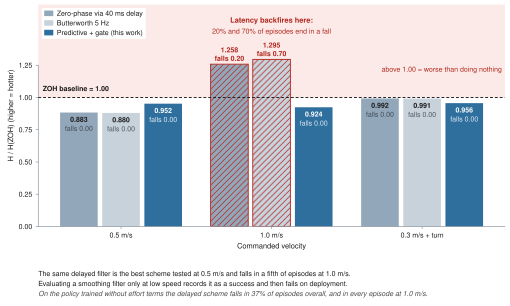

The delayed zero-phase filter succeeds at 0.5 m/s, with a 12% heat reduction and zero falls, but
destabilizes at 1.0 m/s, with a 20% fall rate and a 25.8% heat increase. Similarly, the 5 Hz
Butterworth induces falls in 70% of episodes at 1.0 m/s. Gating the predictive filter by joint load
costs 2.5 percentage points of thermal relief but maintains tracking fidelity at 0.995 of baseline at
1.0 m/s without falls.

### 5.6 Invariant recovery ratio on unregularized policies

Evaluating the closed-loop pipeline on an unregularized policy, trained without torque or energy
penalties, demonstrates consistent budget recovery.

| Metric | Full reward baseline | No effort terms |
|---|---|---|
| Baseline ZOH heat | 255.9 | **376.3 (+47%)** |
| Band split (DC / gait / 5–25 Hz / > 25 Hz) | 31.3 / 50.6 / 16.5 / 1.6% | 27.0 / 29.7 / 40.7 / 2.6% |
| Filter-reachable share | **18.1%** | **43.3%** |
| Command predictor $R^2$ (closed loop) | 0.609 | 0.402 |
| Predictive filter $\mathcal{H}/\mathcal{H}_0$ | 0.915 | **0.765** |
| Recovered / reachable fraction | **47%** | **54%** |
| Predictive + gate $\mathcal{H}/\mathcal{H}_0$ | 0.940 | 0.879 |
| Predictive + gate tracking error | 1.157 | 1.149 |
| Zero-phase via delay $\mathcal{H}/\mathcal{H}_0$ | 1.082 | 1.053 |
| Zero-phase via delay fall rate | 0.07 | **0.37** |

*Table 9: Performance comparison between regularized and effort-ablated policies (E3, E4). The
predictor $R^2$ row is the closed-loop fit; the open-loop fit of §5.3 is a different quantity
(Appendix B, ruling B1).*

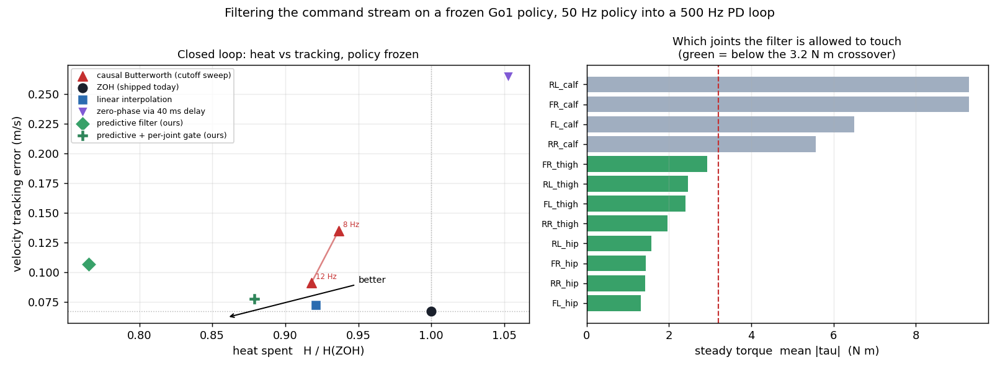

Removing effort terms inflates baseline dissipation by 47% and increases the reachable budget from
18.1% to 43.3%. The predictive filter recovers 47% and 54% of this reachable pool across the two
policies, respectively. While raw thermal savings differ by nearly 3×, 8.5% against 23.5%, the recovery
ratio remains invariant.

---

## 6. Practical Engineering Guidelines

- **Profile spectral splits before intervening.** A single baseline rollout establishes the reachable
  budget. Halving this reachable share provides an accurate a priori estimate of closed-loop thermal
  recovery without modifying low-level code. If the reachable fraction is small, efforts must target
  kinematic posture or reward formulations rather than filtering.
- **Avoid delayed zero-phase smoothing.** Smoothing latency directly erodes feedback phase margin.
  Candidate smoothing architectures must be validated at maximum commanded velocities, where
  latency-induced falls manifest.
- **Deploy load-dependent gating.** Restrict command smoothing to joints operating below
  $\bar{\tau} \approx \sqrt{\mathrm{Var}(\tau)}$. This preserves tracking fidelity on stance joints
  while eliminating jitter on unloaded joints.
- **Prioritize effort regularization over action rate.** Reward terms penalizing joint torque and power
  dictate 89% of transient thermal load, compared to 8% governed by discrete finite-difference
  `action_rate` penalties.

---

## 7. Related Work

**Thermal-aware locomotion.** Recent frameworks integrate motor temperature observations and thermal
reward boundaries,[2] train thermal residual policies,[3] or employ contact-constrained inverse
kinematics for multi-limbed humanoid thermal balancing.[9] These approaches require complete
retraining, whereas this work establishes post-hoc interventions on frozen policies.

**Actuation interfaces.** Interfaces designed to bridge high-level commands and motor drives include
reality shaping via two-degree-of-freedom tracking controllers,[10] high-frequency torque
interpolation,[11] voltage-realizable acceleration bounds,[12] action chunk post-optimization,[13]
B-spline policy representations,[14] and forward delay compensation networks.[15] We characterize the
energetic dissipation consequences of these interfaces.

**Smoothness regularization.** Methods such as CAPS,[5] Lipschitz-constrained architectures,[16] and
spectral normalization[17] suppress command oscillations during training, and a benchmark study reports
improved control smoothness at small performance cost.[18] However, these studies do not isolate
physical copper loss from steady-state posture loads.

**Control discretization.** Low-frequency execution has demonstrated robustness on ANYmal C at
8 Hz,[19] Q-learning is known to degenerate as the time step shrinks,[20] and adaptive action-duration
frameworks reduce average control frequency.[21] None of these works map electrical dissipation as an
explicit function of control rate.

---

## 8. Limitations and Future Work

This study relies on rigid-body simulation using squared torque as a proxy for electrical winding loss
under constant torque sensitivity $K_t$. Stator iron core losses, inverter switching dynamics, and
winding thermal diffusion are omitted. Single-joint analytical sweeps omit ground impact dynamics.
Evaluations are conducted on flat terrain using a single quadruped morphology, the Unitree Go1. The
5 Hz gait split is a hand-chosen parameter and has not been swept, and the reward ablations of §5.2 are
now carry five seeds and paired intervals (Appendix A.2), while every other experiment here remains
single-seed, including the closed-loop results of §5.5, whose episode counts give spread across
episodes rather than across training runs. Extending
four-band spectral decomposition to humanoid platforms such as the Unitree G1, and validating the
3.2 N·m crossover on physical dynamometer testbenches, represent essential future directions.

---

## 9. Conclusion

Actuator thermal overload in learned legged locomotion decomposes into steady-state posture torque and
dynamic command ripple. Because these components add in quadrature, command filtering provides thermal
relief only on lightly loaded joints operating below the analytical crossover. In closed-loop
execution, filter phase lag directly degrades stability margins at operating speeds. Consequently,
causal predictive filtering with load-dependent gating provides a reliable framework to recover
actuator thermal margins on frozen checkpoints without retraining.

---

## References

Entries [1]–[21] are cited above. The full verified 60-entry bibliography is in `references-60.md`;
entries [22]–[60] are not yet placed in the text (Appendix C). Entries [61]–[63] were added to retire
the internal repository document that [6] used to be.

[1] NVIDIA Research, "Ankle roll motors overheating on G1," GR00T-WholeBodyControl, GitHub issue #174, 2026. Available: https://github.com/NVlabs/GR00T-WholeBodyControl/issues/174

[2] *authors pending*, "Learning thermal-aware locomotion policies for an electrically-actuated quadruped robot," arXiv:2603.01631, 2026.

[3] Y. Wan, W. Lin, L. Qian, Y. Zou, W. Wu, S. Liao, C. Zhao, and X. Luo, "Learning to balance motor thermal safety and quadrupedal locomotion performance with residual policy," arXiv:2605.27046, 2026.

[4] T. Matsuzawa, K. Irie, T. Yoshida, T. Suzuki, Y. Hara, and M. Tomono, "Long-distance real-world navigation of the legged-wheeled robot Go2-W using deep reinforcement learning," arXiv:2606.21387, 2026.

[5] S. Mysore, B. Mabsout, R. Mancuso, and K. Saenko, "Regularizing action policies for smooth control with reinforcement learning," in *Proc. ICRA*, 2021. arXiv:2012.06644.

[6] Unitree Robotics, "GO-M8010-6 motor data user manual," V1.0, 2023. Available:
https://techshare.co.jp/faq/wp-content/uploads/2023/12/GO-M8010-6_Motor_Data_User_Manual_V1.0.pdf
— the datasheet field is *communication control frequency*, 6000 Hz; it is not labelled a current-loop rate.

[7] maxon motor ag, "EC max 30 Ø30 mm, brushless, 60 W," datasheet, 2024.

[8] K. Urs, C. E. Adu, E. J. Rouse, and T. Y. Moore, "Design and characterization of 3D printed, open-source actuators for legged locomotion," in *Proc. IROS*, 2022. arXiv:2202.12395.

[9] S. J. Jorgensen, J. Holley, F. Mathis, J. S. Mehling, and L. Sentis, "Thermal recovery of multi-limbed robots with electric actuators," *IEEE Robotics and Automation Letters*, vol. 4, no. 2, pp. 1077–1084, 2019. arXiv:1902.00187.

[10] S. Yamamori et al., "Actuator reality shaping for zero-shot sim-to-real robot learning," arXiv:2607.02205, 2026.

[11] R. Kourdis, M. Stępień, J. Manhes, N. Mansard, S. Tonneau, P. Souères, and T. Flayols, "Very high frequency interpolation for direct torque control," arXiv:2509.24175, 2025.

[12] L. Zhang, J. Wang, T. Zhang, Z. Song, X. Zeng, W. Xia, Z. Li, and Y. Liu, "VRA: Grounding discrete-time joint acceleration in voltage-constrained actuation," in *Proc. RSS*, 2026. arXiv:2605.10696.

[13] D. Son and S. Park, "LiPo: A lightweight post-optimization framework for smoothing action chunks generated by learned policies," arXiv:2506.05165, 2025.

[14] X. Han, H. Xiong, H. Chen, C. Liu, A. Torralba, Y. Zhu, and Y. Du, "B-spline policy: Accelerating manipulation policies via B-spline action representations," arXiv:2607.09648, 2026.

[15] J. C. Weddington, B. P. Ölveczky, and S. A. Baccus, "Reinforcement learning on cost-constrained quadrupedal hardware," arXiv:2607.26434, 2026.

[16] Z. Chen, X. He, Y.-J. Wang, Q. Liao, Y. Ze, Z. Li, S. S. Sastry, J. Wu, K. Sreenath, S. Gupta, and X. B. Peng, "Learning smooth humanoid locomotion through Lipschitz-constrained policies," in *Proc. IROS*, 2025. arXiv:2410.11825.

[17] J. Shin, W. Cha, D. Kim, J. Cha, and J. Park, "Spectral normalization for Lipschitz-constrained policies on learning humanoid locomotion," arXiv:2504.08246, 2025.

[18] G. Christmann, Y. Luo, H. Mandala, and W. Chen, "Benchmarking smoothness and reducing high-frequency oscillations in continuous control policies," in *Proc. IROS*, 2024.

[19] S. Gangapurwala, L. Campanaro, and I. Havoutis, "Learning low-frequency motion control for robust and dynamic robot locomotion," in *Proc. ICRA*, 2023.

[20] C. Tallec, L. Blier, and Y. Ollivier, "Making deep Q-learning methods robust to time discretization," in *Proc. ICML*, 2019.

[21] A. Sukhija, L. Treven, J. Cheng, F. Dörfler, S. Coros, and A. Krause, "TARC: Time-adaptive robotic control," arXiv:2510.23176, 2025.

[61] DEEP Robotics, "J60 joint," product page, 2024. Available: https://www.deeprobotics.cn/en/wap/j60.html
— states a communication control frequency of 1 kHz.

[62] Unitree Robotics, "unitree_legged_sdk," `example_py/example_position.py`, GitHub, 2024. Available:
https://github.com/unitreerobotics/unitree_legged_sdk/blob/master/example_py/example_position.py
— the example control loop uses `dt = 0.002`, i.e. 500 Hz. Code, not documentation.

[63] DEEP Robotics, "Physical AI 101: reinforcement learning with the Lite3," company blog, 2025. Available:
https://www.deeprobotics.us/news/physical-ai-101-the-ultimate-guide-to-mastering-reinforcement-learning-with-the-deep-robotics-lite3/
— states a 1 kHz real-time control loop. Does not state a policy rate.

---

## Appendix A. Planned additions (not yet run)

A.2 is done and is reported in §5.2. The remaining items are `pending` and are reported nowhere.

**A.1 Gait-split sensitivity sweep.** $f_g = 5$ Hz is hand-chosen. Sweep 3–8 Hz and plot the reachable
share, to show the core conclusions hold regardless of the exact split.

**A.2 Multi-seed reward ablation. Done.** All seven variants were retrained from five seeds at 60M
timesteps each, 35 runs in total. §5.2 and Table 2 report mean ± s.d. with paired per-seed intervals.
The headline change: the `action_rate` effect, previously reported as +8% from one seed, is +5% ± 6
over five and is not separable from seed noise. Per-seed values are in
`data/results/ablation-multiseed-raw.csv`; the analysis is `data/scripts/multiseed_ablation.py`.

**A.3 G1 humanoid verification.** Run the same four-band decomposition on a G1 standing and walking, to
support the cross-morphology claim the introduction leans on.

**A.4 Single-joint hardware bench.** One motor, a torque load, a current probe: verify the 3.2 N·m
crossover under injected out-of-band command power.

---

## Appendix B. Numeric reconciliation

The v1 source draft (`paper-command-filtering-draft.md`) is authoritative for every quantity in this
document. v1 is internally inconsistent in several places: where its own tables and prose disagree,
the **table** is used, because in each case below the table value is independently corroborated
elsewhere in v1 and the prose value is not. Line references are to v1.

| # | Resolution | Basis |
|---|---|---|
| B1 | Predictor $R^2$ is **two quantities, not one contradiction**. Open-loop replay (E2): 0.679 / 0.385 / 0.059. Closed loop (E3, E4): 0.609 / 0.402. | v1:347 reports the first inside §5.3; v1:491 reports the second in the §5.6 table, corroborated at v1:573. Both retained and labelled. |
| B2 | Zero-phase-via-delay overall fall rate is **0.07**. The 13% figure is dropped. | v1:406 table gives 0.07; the v1 per-velocity breakdown 0.00 / 0.20 / 0.00 averages to 0.067. The 13% at v1:447 is supported by no table. |
| B3 | Zero-phase-via-delay heat increase is **8.2%** ($\mathcal{H}/\mathcal{H}_0 = 1.082$). The 8.5% figure is dropped. | v1:406. The 8.5% at v1:447 collides with the predictive filter's 8.5% *reduction*, which the 47% recovery ratio is built on. |
| B4 | Predictive filter, policy-aware: **0.915** heat, **1.279** tracking. Policy-unaware: **0.927** heat, **1.236** tracking. | v1:407 and v1:409. The prose values at v1:477 (0.917 / 1.249 / 1.214) are dropped; 0.915 is what 8.5% and 47% derive from throughout. |
| B5 | Seven ablated policies were trained; five are reported. **Not a contradiction.** | v1:222 and v1:301 both say seven; v1's Table 2 lists five rows, as does this draft. The two unreported variants are `pending`. |
| B6 | Linear interpolation removes **4.4%** of heat in *closed* loop, and the claim belongs to Table 6. | v1:401 gives $\mathcal{H}/\mathcal{H}_{\text{ZOH}} = 0.956$. An earlier draft attached the claim to Table 7, which has no linear-interpolation row. |
| B7 | **E4 was never assigned in the source experiments.** The protocols are renumbered E1--E4 here, so no gap is visible; the original labels were E1, E2, E3, E5. | v1 defines E1 (v1:213), E2 (v1:222), E3 (v1:229) and E5 (v1:240) only. Figure filenames `e3-` and `e4-` follow a third, informal numbering and are left as-is. |
| B8 | $\rho$ and $\rho_{>5\,\mathrm{Hz}}$ are **different cuts** and are labelled distinctly throughout. | §3.2 defines $\rho$ against the $-3$ dB bandwidth of 15.3 Hz; Table 2's column is the coarser 5 Hz cut. Both appear in v1; neither is wrong. |

---

## Appendix C. Pending values

Quantities that exist in no draft, or that the text asserts without a source. Each is flagged at its
point of use rather than estimated.

| Item | Where it appears | What closes it |
|---|---|---|
| Author, affiliation, contact | Title block of the reading page | Author decision. |
| Reference [2] author list | References | The arXiv:2603.01631 abstract page. An earlier draft carried a four-name list that no search could confirm; it has been removed rather than reprinted. |
| ~~Source for the 83 Hz Lite3 policy rate~~ **RESOLVED: claim removed** | §2 | **No public source states it.** The only published Lite3 policy rate found is roughly 50 Hz, which contradicts it; 83 Hz is reconstructable as 1000/12, which is an inference rather than a citable fact. The 1 kHz state loop is separately sourced [63]. Either a first-hand deployment measurement, or removal of the figure. |
| Statistics for two of the seven ablation variants | §5.2, Table 2 | The ablation run logs. |
| Confidence intervals and seed counts — **closed for §5.2** | §5.2, §8 | Appendix A.2 delivered five seeds and paired intervals. Still open for every other experiment, which §8 now states. |
| Gait-split sensitivity | §3.1, §8, Appendix A.1 | Sweeping $f_g$ over 3–8 Hz. |
| G1 humanoid band decomposition | §1, §8, Appendix A.3 | Running E4 on a G1. The cross-morphology claim rests on it. |
| Hardware confirmation of the 3.2 N·m crossover | §5.1, §8, Appendix A.4 | One motor, a torque load and a current probe. |
| Text placement for references [22]–[60] | References | 39 of the 60 verified entries are not yet cited anywhere in the prose, which only reaches [21]. Either cite them or cut them before submission. |
| Regeneration of `command-spectrum.png` from source rollouts | §5.2, Fig. 5 | The source rollouts are not in this repository. `figsrc/annotate_command_spectrum.py` adds a band ruler that distinguishes the 15.3 Hz shading from the 5–25 Hz claim without touching a data pixel, but the panel itself has not been re-plotted. |

**Reference [6] retired.** It was `docs/legged-rl-control-stack-reference.md`, an internal repository
file, which cannot be a citation in a submitted paper. It is replaced by three public vendor sources,
[6], [61] and [62], plus [63] for the Lite3 loop rate. One caveat survives: the 6 kHz figure is the
datasheet's *communication control frequency*, which is not the same thing as a commutation or
current-loop rate, and §2 currently describes it as a commutation loop.

---

## Companion artefacts

| File | What it is |
|---|---|
| `references-60.md` | 60-entry verified bibliography + per-entry annotation and section mapping |
| `references-60.html` | The reading page's reference block, 63 entries |
| `figsrc/fig1_architecture.py` | Fig. 1 — policy → filter → ZOH → PD → motor, with the feedback loop and torque tap |
| `figsrc/fig5_three_filters.py` | Fig. 2 — three smoothing kernels on one time axis |
| `figsrc/fig2_crossover.py` | Fig. 4 — quadrature crossover at 3.2 N·m with the Go1 joint families placed |
| `figsrc/fig3_band_budget.py` | Fig. 8 — four-band heat budget, both policies |
| `figsrc/fig4_latency.py` | Fig. 10 — closed-loop latency failure across the three commanded velocities |
| `figsrc/annotate_command_spectrum.py` | Fig. 5 — adds the band ruler to `pic/command-spectrum.png` without touching a data pixel |
| `fig/*.svg` | Output of the scripts above. English only, light background. Regenerate by rerunning them. |
| `pic/*.png`, `pic/*.gif` | Original experiment plots and the phase-lag animation. Not regenerated. |
| `paper-comic-plan.md` | paper-comic Steps 1–4; Step 5 blocked, no image-generation backend installed |
| `paper-page.html.tmpl` + `build_page.py` | Reading page, typeset as a paper, light-only. Build with `python build_page.py` |
