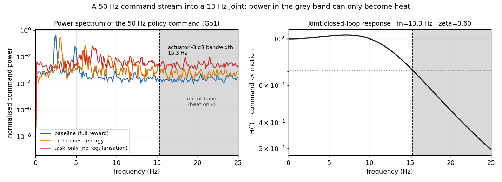

# Where the Heat Actually Is: Decomposing Actuator Load in Learned Legged Locomotion and the Limits of Command Filtering

*Draft v2 (user revision, 2026-09-10). Simulation only. No hardware results yet.*

Figures: `pic/` · Original draft: `paper-command-filtering-draft.md`

---

## Abstract

Reinforcement learning (RL) locomotion policies frequently overheat commercial quadrupedal and humanoid actuators in operating regimes where vendor controllers remain thermally stable. The standard explanation attributes this dissipation to high-frequency command jitter, prescribing smoothness penalties in the reward function as the default remedy. However, this hypothesis has not been evaluated against the alternative explanation: that learned policies adopt postures demanding higher steady-state torque.

We decouple these mechanisms by demonstrating that electrical copper loss decomposes into a posture term and a ripple term. Because these terms add in quadrature, their relative dominance depends strictly on joint steady-state torque. We locate this crossover threshold analytically and empirically at 3.2 N·m on a Unitree Go1 quadruped. Load-bearing calf joints operate above this threshold, carrying only 14–17% of their heat in bands accessible to filtering; conversely, hip abduction joints operate below it, carrying 33–45% of their thermal dissipation in the filter-reachable band.

Evaluating post-hoc command filtering on frozen policies, our spectral decomposition reveals that zero-order hold (ZOH) staircase harmonics account for only 1.6% of total heat, whereas 5–25 Hz command content accounts for the remaining discretionary dissipation. Although open-loop evaluation suggests a 46% thermal reduction via zero-phase filtering, this ceiling collapses in closed loop. Introducing latency to eliminate phase lag degrades feedback stability, inducing falls in 20% of episodes at 1.0 m/s on well-regularized policies and in every episode on unregularized policies. Conversely, a causal predictive filter combined with joint-load gating safely recovers 47–54% of the reachable thermal budget across both regularized and unregularized checkpoints without inducing falls. Finally, we demonstrate that commonly deployed `action_rate` penalties fail to govern command-side thermal load, whereas effort penalties dictate the reachable budget.

---

## 1. Introduction

Legged locomotion policies trained via reinforcement learning (RL) frequently encounter actuator thermal limits during real-world deployment. On a Unitree G1 humanoid running a whole-body controller, ankle-roll actuators reach approximately 90 °C within 5 to 10 minutes during static standing, whereas the manufacturer's controller maintains the identical joints between 30 °C and 45 °C.[1] Similarly, on a Unitree A1 carrying a 3 kg payload, baseline RL policies trigger thermal protection in 5 to 7 minutes.[2], [3] Conversely, on a Go2-W, a learned policy plateaus at 60 °C over 51 minutes of walking, whereas the vendor controller diverges to 84 °C and shuts down at 34 minutes.[4] These observations confirm that policy behavior dictates thermal dissipation, yet the community remains divided regarding the governing mechanism.

Two competing hypotheses currently prevail:

- **The Posture Hypothesis.** Thermal dissipation is governed by the steady-state holding torque demanded by the chosen kinematic posture. This is supported by Go2-W trials, where a 24 °C difference at 50 Hz was attributed to periodic foot lifting that relieved steady joint torque.[4]
- **The Jitter Hypothesis.** Excessive heating stems from high-frequency command oscillations that inflate RMS current without producing functional torque. This is supported by the G1 ankle-roll failure, where static holding torque is fixed by gravity, yet controllers exhibit a 45–60 K temperature disparity.[1]

Neither hypothesis has measured both terms independently. Physical copper loss dictates that posture torque and dynamic torque ripple add in quadrature:

$$
\mathcal{H} \;\propto\; \mathbb{E}[\tau^2] \;=\; \underbrace{\bar{\tau}^2}_{\text{posture}} \;+\; \underbrace{\mathrm{Var}(\tau)}_{\text{ripple}} .
$$

A zero-mean command ripple produces no net torque while contributing its full variance to thermal dissipation. Crucially, because the terms add in quadrature, a substantial steady torque $\bar{\tau}$ suppresses the relative contribution of $\mathrm{Var}(\tau)$. Whether command jitter governs thermal load is therefore a function of joint-specific loading rather than an intrinsic property of the policy.

In this work, we locate the crossover between these two regimes, quantify the thermal recovery attainable via command filtering on frozen policies, and identify the closed-loop stability boundaries that govern filter deployment.

### Contributions

1. **Spectral Heat Decomposition.** We formulate an exact Parseval-based decomposition separating joint torque into steady posture, gait-synchronous torque, in-band jitter (5–25 Hz), and ZOH discretization harmonics (> 25 Hz). The reachable budget is 18.1% for a well-regularized Go1 policy and 43.3% for a policy trained without effort penalties, with ZOH harmonics accounting for only 1.6%.
2. **Thermal Load Crossover.** We establish that out-of-band heating follows $\mathcal{H} = \mathcal{H}_0 + \kappa\,\rho/(1-\rho)$ to within 0.45% residual. Posture overtakes ripple at $\bar{\tau} \approx \sqrt{\mathrm{Var}(\tau)} \approx 3.2$ N·m on a Go1. Joints below this threshold exhibit two to three times the filter-reachable heat share of joints operating above it.
3. **Closed-Loop Latency Penalties.** We demonstrate that the open-loop 46% thermal reduction ceiling collapses to 8.5% in closed loop (Cliff's $\delta = -0.33$). Introducing a 40 ms latency to achieve zero-phase smoothing compromises policy feedback margins, resulting in fall rates of 20% at 1.0 m/s on regularized policies and 100% on unregularized policies.
4. **Predictive Gated Filtering.** An order-8 causal linear autoregressive filter recovers 47% and 54% of the filter-reachable budget across regularized and unregularized policies, respectively, without inducing falls. Gating the filter by joint load preserves tracking fidelity.
5. **Reward Ablation Analysis.** We show that `action_rate` penalties increase step transients by only 8% when ablated, whereas effort and energy penalties govern 89% of the transient magnitude.

---

## 2. Actuation Pipeline and Problem Formulation

Commercial quadruped and humanoid architectures execute proportional-derivative (PD) loops directly on the motor drive rather than within the policy process. The policy outputs position targets at $f_{\text{pol}}$, which are transmitted across a communication bus to motor-side PD loops running at higher frequencies. On Unitree systems, the policy executes at 50 Hz and low-level commands are written at 500 Hz.[62]
DeepRobotics Lite3 deployments run a 1 kHz state loop.[63] Vendor datasheets give a communication
control frequency of 6 kHz for the Unitree GO-M8010-6[6] and 1 kHz for the DeepRobotics J60.[61]
The policy rate used in Lite3 deployments is `pending`: an earlier draft put it near 83 Hz, but no
public source states that figure and the only published rate we could find is roughly 50 Hz.

A zero-order hold (ZOH) interfaces the policy to the low-level loop. At 50 Hz into 500 Hz, each command is held for 10 ticks before stepping discontinuously, producing an instantaneous proportional transient of $k_p \Delta q$ prior to rotor displacement.

In standardized environments such as `unitree_rl_mjlab`, PD gains are derived from a target closed-loop natural frequency of 10 Hz and a damping ratio of $\zeta = 2.0$, with action scaling set to $0.25\,e/k_p$, where $e$ represents the effort limit. Consequently, an action reversal between successive policy steps commands a peak transient:

$$\tau_{\text{step}} = k_p \cdot 2 \cdot \frac{0.25\,e}{k_p} = 0.5\,e .$$

A full-scale action reversal commands a transient equal to half the joint torque limit. With $\zeta = 2.0$, the dominant closed-loop pole is located at 2.68 Hz, whereas the 50 Hz command stream contains spectral content up to the 25 Hz Nyquist limit.

---

## 3. Metrics

**Spectral Heat Decomposition.** Applying Parseval's theorem to joint torque partitioned into mean and zero-mean components yields:

$$ \mathbb{E}[\tau^2] \;=\; \bar\tau^2 \;+\; \int_{0}^{f_g} S_\tau(f)\,\mathrm{d}f \;+\; \int_{f_g}^{f_{\text{Nyq}}} S_\tau(f)\,\mathrm{d}f \;+\; \mathbb{E}_k\!\left[\mathrm{Var}_{\text{sub}}(\tau)\right] , $$

where $f_g = 5$ Hz isolates fundamental gait frequencies, $f_{\text{Nyq}} = 25$ Hz represents the policy Nyquist frequency, and $\mathbb{E}_k[\mathrm{Var}_{\text{sub}}(\tau)]$ denotes intra-step variance above Nyquist arising from ZOH discretization. The sum of the final two terms defines the **reachable share** available to command-stream filtering.

**Ripple Fraction.** When power spectral density is unavailable, we compute the joint-level ripple fraction:

$$ r \;=\; \frac{\mathrm{Var}(\tau)}{\bar{\tau}^2 + \mathrm{Var}(\tau)} . $$

**Out-of-Band Command Power ($\rho$).** Command-side jitter is quantified independently of the physical plant via:

$$ \rho \;=\; \frac{\int_{f_c}^{f_{\text{Nyq}}} S_q(f)\,\mathrm{d}f}{\int_{0}^{f_{\text{Nyq}}} S_q(f)\,\mathrm{d}f} , $$

where $f_c$ is the joint $-3$ dB closed-loop bandwidth, 15.3 Hz for the Go1 model of §4. Table 2 reports a
second, coarser cut of the same quantity taken at 5 Hz; it is written $
ho_{>5\,\mathrm{Hz}}$ throughout
and is not interchangeable with $
ho$.

**Thermal Proxy.** We quantify motor thermal load via $\mathcal{H} = \frac{1}{T}\int_0^T \tau^2\,\mathrm{d}t$, proportional to $I_{\text{rms}}^2 R$ under a constant torque coefficient. Stator thermal dynamics justify using squared torque rather than absolute torque: on calibrated brushless actuators, the winding thermal time constant is 3.12 s compared to 777 s for the entire motor housing (a factor of 249).[7] Reported driver temperatures lag winding heat, making current-based proxies the relevant primary metric.[8]

---

## 4. Experimental Setup

We evaluate filtering through four experimental protocols. The labels are those of the source draft;
there is no E4, as the label was never assigned.

- **E1 (Single Joint, Synthetic Commands).** A second-order joint modeled on the Go1 ($k_p = 35$, damping 0.5, armature 0.005 kg·m², $f_n = 13.3$ Hz, $\zeta = 0.60$, $-3$ dB bandwidth at 15.3 Hz) is driven by a 2 Hz sinusoidal command with bandpass noise injected above bandwidth. Commands are sampled at 50 Hz, held via ZOH to 500 Hz, and integrated at 5 kHz. Constant load torques are swept from 0 to 20 N·m.
- **E2 (Recorded Commands, Open Loop).** Trajectories recorded from seven Go1 policies are replayed through the single-joint model across different filtering schemes. Preserved motion is benchmarked against the ZOH trajectory low-passed at 5 Hz.
- **E3 (Closed Loop, Full Quadruped).** A frozen Go1 policy is deployed in MuJoCo (50 Hz policy, 500 Hz physics, 10 substeps per policy step). The filter operates inside the closed loop. We evaluate 10 episodes of 500 steps across three commanded velocities (0.5 m/s, 1.0 m/s, and 0.3 m/s with turning) under matched random seeds and noise.
- **E5 (Spectral Decomposition).** Evaluated under baseline ZOH over 30 rollouts across three velocity commands. Mean torque per policy step is logged at 50 Hz, with spectral splits at 5 Hz and 25 Hz, and intra-step variance providing the > 25 Hz component.

**Predictive Filter Architecture.** An order-8 linear autoregressive model AR(8) is fitted via least squares to baseline rollouts and rolled forward two steps, enabling zero-latency application of a symmetric Hann window.

**Load Gate.** Joints exhibiting mean absolute torque $|\bar{\tau}|$ below the 3.2 N·m crossover are filtered; remaining joints pass through unmodified.

---

## 5. Results

### 5.1 Load-Dependent Thermal Crossover

Holding motion amplitude constant, the thermal penalty of out-of-band command power depends on joint static loading.

| Static Load | $\rho=0.02$ | $0.05$ | $0.10$ | $0.20$ | $0.40$ |
|---|---|---|---|---|---|
| 0 N·m | 1.81 | 3.08 | 5.38 | 10.86 | 27.30 |
| 2 N·m | 1.15 | 1.40 | 1.84 | 2.89 | 6.04 |
| 5 N·m | 1.03 | 1.08 | 1.16 | 1.36 | 1.96 |
| 10 N·m | 1.01 | 1.02 | 1.04 | 1.09 | 1.25 |
| 20 N·m | 1.00 | 1.00 | 1.01 | 1.02 | 1.06 |

*Table 1: Thermal dissipation relative to $\rho = 0$ across load levels (three seeds).*

At $\rho = 0.2$, an unloaded joint dissipates 10.9 times the heat while moving 1.8% more, whereas a joint carrying 20 N·m dissipates 2% more heat. In the unloaded condition, dissipation follows $\mathcal{H} = \mathcal{H}_0 + \kappa\,\rho/(1-\rho)$ with $\kappa = 38.4$ and a maximum residual of 0.45%. The crossover threshold, where $\bar{\tau}^2 = \mathrm{Var}(\tau)$, is 3.2 N·m.

On the Go1 quadruped, mean $|\tau|$ per joint family is:

- Hip abduction: 1.24–1.48 N·m
- Thigh: 2.00–2.59 N·m
- Calf: 5.88–6.88 N·m

Eight of the twelve joints operate below the 3.2 N·m threshold; the four knee joints operate above it. This explains why posture dominates knee dissipation while jitter dominates non-weight-bearing joints, such as the G1 ankle-roll motor.

### 5.2 Effort Terms Govern Jitter; `action_rate` Does Not

We analyze command statistics across seven ablated Go1 policies (single seed, 8 s duration).
Table 2 reports five representative variants; statistics for the remaining two are `pending`.

| Policy Variant | $\Delta q_{\text{rms}}$ (rad) | $\tau_{\text{step}}$ RMS (N·m) | Centroid (Hz) | $\rho_{>5\,\mathrm{Hz}}$ |
|---|---|---|---|---|
| Full reward baseline | 0.0668 | 2.34 | 3.29 | 0.051 |
| No `action_rate` | 0.0723 | 2.53 (+8%) | 3.43 | 0.119 |
| No gait terms | 0.0747 | 2.62 (+12%) | 4.98 | 0.146 |
| No torques + energy | 0.1267 | 4.43 (+89%) | 5.44 | 0.363 |
| Task terms only | 0.1586 | 5.55 (+137%) | 10.44 | 0.898 |

*Table 2: Command-side spectral properties across reward ablations.*

Ablating `action_rate` increases step transients by 8%. In contrast, removing torque and energy penalties increases step transients by 89%. In our evaluations, direct effort minimization governs command-side thermal load rather than finite-difference action smoothing.

### 5.3 Open-Loop Filtering and the Cost of Phase Lag

Replaying full-reward policy commands through the unloaded joint yields:

| Filtering Scheme | Heat ($H/H_{\text{ZOH}}$) | Preserved Motion | Deployable |
|---|---|---|---|
| Baseline ZOH | 1.000 | 1.000 | — |
| Linear interpolation | 0.696 | 0.819 | Yes |
| Causal Butterworth (12 Hz) | 0.588 | 0.745 | Yes |
| Predictive filter | 0.428 | 0.741 | Yes |
| Zero-phase Butterworth (12 Hz) | 0.540 | 0.995 | No |

*Table 3: Open-loop command replay through an unloaded joint.*

Zero-phase filtering reduces thermal dissipation by 46% while matching the in-band trajectory to within 0.0004 rad. However, the causal version of the identical filter preserves only 74.5% of intended motion due to phase lag, imposing motion penalties of 25.0, 24.8, and 22.9 percentage points at 0, 2, and 10 N·m loads, respectively.

Out-of-sample accuracy of the **open-loop** command predictor reaches $R^2 = 0.679$ on the full-reward
policy, 0.385 without effort terms, and 0.059 without regularization. A separate predictor fitted for the
closed-loop experiments reports different values; see §5.6 and Appendix B, ruling B1. Policies exhibiting higher command jitter are less predictable, constraining open-loop reconstruction.

### 5.4 Spectral Allocation of the Thermal Budget

Closed-loop spectral decomposition of baseline Go1 locomotion rollouts confirms the physical limits of filtering:

| Band | Physical Mechanism | Share of Total Heat |
|---|---|---|
| DC | Posture: static body support | 31.3% |
| 0–5 Hz | Gait: torque modulation required for walking | 50.6% |
| 5–25 Hz | In-band jitter: accessible via low-pass filtering | 16.5% |
| > 25 Hz | ZOH staircase harmonics: discretization artifacts | 1.6% |
| **Total reachable** | Combined jitter and discretization harmonics | **18.1%** |

*Table 4: Exact closed-loop torque spectral decomposition across 30 rollouts. The components sum to 255.9, matching the independently computed heat proxy of 256.2 to within 0.1%.*

The ZOH staircase accounts for only 1.6% of total heat. Discretionary dissipation resides between 5 and 25 Hz (16.5%). Furthermore, the reachable budget varies systematically across joint families:

| Joint Family | Mean $\vert\tau\vert$ (N·m) | DC | Gait | 5–25 Hz | > 25 Hz | Reachable |
|---|---|---|---|---|---|---|
| Hips | 1.2–1.5 | 7–21% | 47–54% | 33–45% | 0.3–0.4% | **33–45%** |
| Thighs | 2.0–2.6 | 2–19% | 56–78% | 16–29% | 3.0–4.0% | **20–32%** |
| Calves | 5.9–6.9 | 32–38% | 45–54% | 13–16% | 1.1–1.6% | **14–17%** |

*Table 5: Joint-specific torque budget decomposition.*

### 5.5 Closed-Loop Filtering: Latency Induces Instability

When command filters are deployed within the feedback loop, the open-loop benefits collapse.

| Scheme | $H/H_{\text{ZOH}}$ | Tracking Error | $\delta(H)$ | $\delta(\text{vel})$ | Fall Rate ($n{=}30$) |
|---|---|---|---|---|---|
| Baseline ZOH | 1.000 | 1.000 | 0.00 | 0.00 | 0.00 |
| Linear interpolation | 0.956 | 1.048 | −0.31 | 0.13 | 0.00 |
| Butterworth 5 Hz | 1.098 | 2.594 | −0.04 | 1.00 | 0.23 |
| Butterworth 8 Hz | 0.946 | 1.444 | −0.28 | 0.93 | 0.00 |
| Butterworth 12 Hz | 0.935 | 1.160 | −0.28 | 0.52 | 0.00 |
| Butterworth 12 Hz + linear | 0.942 | 1.284 | −0.26 | 0.75 | 0.00 |
| Zero-phase via 40 ms delay | 1.082 | 2.493 | −0.03 | 1.00 | 0.07 |
| Predictive filter | 0.915 | 1.279 | −0.33 | 0.71 | 0.00 |
| Predictive + per-joint gate | 0.940 | 1.157 | −0.33 | 0.50 | 0.00 |
| Predictive, policy unaware | 0.927 | 1.236 | −0.33 | 0.64 | 0.00 |

*Table 6: Full-body closed-loop locomotion performance ($n = 30$ per scheme). Cliff's $\delta$ is reported against ZOH. In repeated runs of the full matrix, aggressive schemes fell between 7% and 30% of the time, while other schemes recorded no falls.*

The predictive filter reduces total heat by 8.5% (Cliff's $\delta = -0.33$). Against the 18.1% reachable
budget, this represents a 47% recovery ratio. Linear interpolation, the intervention the zero-order hold
most obviously invites, removes 4.4% ($H/H_{	ext{ZOH}} = 0.956$) and is not worth doing.

Tracking the > 25 Hz discretization term shows that reducing ZOH staircase harmonics does not drive thermal savings:

| Scheme | > 25 Hz Term (Absolute) | Total $H/H_0$ |
|---|---|---|
| Baseline ZOH | 4.02 | 1.000 |
| Butterworth 5 Hz | 1.96 | 1.098 |
| Zero-phase via 40 ms delay | 2.34 | 1.082 |
| Butterworth 12 Hz | 2.93 | 0.935 |
| Predictive filter | 4.02 | 0.915 |

*Table 7: Actuator dissipation above Nyquist versus total thermal load.*

Schemes that halve the staircase term exhibit the highest total dissipation, while the predictive filter achieves the lowest total dissipation while leaving the staircase term unchanged.

In closed-loop trials, delaying commands by 40 ms to achieve zero phase increases thermal load by 8.2%
($H/H_0 = 1.082$) and induces falls in 7% of episodes overall. Breaking down performance across commanded forward velocities:

| Scheme | 0.5 m/s ($H/H_0$, Fall) | 1.0 m/s ($H/H_0$, Fall) | 0.3 m/s + turn ($H/H_0$, Fall) |
|---|---|---|---|
| Zero-phase via delay | 0.883, 0.00 | 1.258, 0.20 | 0.992, 0.00 |
| Butterworth 5 Hz | 0.880, 0.00 | 1.295, 0.70 | 0.991, 0.00 |
| Predictive + gate | 0.952, 0.00 | 0.924, 0.00 | 0.956, 0.00 |
| Predictive + gate (tracking) | 1.298 | 0.995 | 1.250 |

*Table 8: Velocity-dependent performance and failure rates.*

At 0.5 m/s, the delayed filter reduces heat by 12% without falls. At 1.0 m/s, it falls in 20% of episodes, while the 5 Hz Butterworth falls in 70% of episodes, increasing heat proxy values by 26% to 30% above baseline.

Gating the predictive filter by joint load costs 2.5 percentage points of heat reduction (from 8.5% to 6.0%) while recovering tracking accuracy; at 1.0 m/s, it reduces heat by 7.5% while tracking slightly better than baseline ZOH (0.995 tracking ratio). Passing filtered versus raw actions to the observation buffer yields minimal difference (0.915 vs. 0.927
heat, 1.279 vs. 1.236 tracking; Table 6).

### 5.6 Invariant Recovery Ratio on Unregularized Policies

We repeated the closed-loop matrix on a policy trained without effort and energy penalties:

| Metric | Full Reward Policy | No Effort Terms Policy |
|---|---|---|
| Baseline ZOH heat | 255.9 | 376.3 (+47%) |
| Band split: DC / Gait / 5–25 Hz / > 25 Hz | 31.3 / 50.6 / 16.5 / 1.6% | 27.0 / 29.7 / 40.7 / 2.6% |
| Filter-reachable share | 18.1% | 43.3% |
| Command predictor $R^2$ (closed loop) | 0.609 | 0.402 |
| Predictive filter heat ($H/H_0$) | 0.915 | 0.765 (−23.5%) |
| Recovered / reachable ratio | 47% | 54% |
| Predictive + gate heat ($H/H_0$) | 0.940 | 0.879 |
| Predictive + gate tracking error | 1.157 | 1.149 |
| Zero-phase via delay heat ($H/H_0$) | 1.082 | 1.053 |
| Zero-phase via delay fall rate | 0.07 | 0.37 |

*Table 9: Comparison between fully regularized and effort-ablated policies.*

Omitting effort terms shifts 25 percentage points of heat into the filter-reachable band (increasing from 18.1% to 43.3%) and inflates total dissipation by 47%. The predictive filter recovers 47% and 54% of the reachable budget across the two policies, respectively, confirming that the recovery ratio remains stable despite a three-fold difference in raw heat savings (8.5% vs. 23.5%).

Although closed-loop command predictability falls from $R^2 = 0.609$ to 0.402, recovery efficacy is not
constrained by predictor accuracy. On the unregularized policy, gating reduces heat by 12.1% for a 15% tracking penalty, compared to the ungated filter's 23.5% heat reduction for a 59% tracking penalty. Delayed filtering fails catastrophically, falling in 37% of episodes overall and in every episode (100%) at 1.0 m/s.

---

## 6. Discussion and Practical Guidance

- **Profile the spectral split before intervention.** A single baseline rollout establishes the reachable budget. Halving this budget accurately estimates attainable closed-loop recovery. If the reachable share is minor, command filtering cannot prevent thermal overload.
- **Do not eliminate phase lag via delay.** Filter latency degrades policy feedback stability margins, precipitating falls at higher velocities. Filtering architectures must be evaluated at maximum commanded speeds.
- **Deploy load-dependent gating.** Filtering should be restricted to joints operating below the crossover threshold $\bar{\tau} \approx \sqrt{\mathrm{Var}(\tau)}$. On the Go1, gating preserved stability while recovering majority tracking fidelity.
- **Prioritize effort regularization over `action_rate`.** Reward formulations targeting thermal safety should penalize joint torque and energy rather than discrete action differences.

---

## 7. Related Work

**Thermal-Aware Locomotion.** Recent methods incorporate motor temperature observations and thermal reward bounds,[2] or train residual policies conditioned on thermal states.[3] Contact-constrained inverse kinematics has similarly addressed multi-limbed humanoid thermal redistribution.[9] These approaches require retraining; our work characterizes post-hoc interventions for frozen policy checkpoints.

**Actuation Interfaces.** Classical architectures include Actuator Reality Shaping via two-degree-of-freedom tracking controllers,[10] high-frequency linear feedback for torque interpolation,[11] voltage-realizable acceleration bounding,[12] action chunk optimization,[13] B-spline policy representations,[14] and forward delay compensation networks.[15] Our analysis addresses the thermal loss consequences of these interfaces.

**Smoothness Regularization.** Methods such as CAPS,[5] Lipschitz-constrained networks,[16] and spectral normalization[17] suppress high-frequency oscillations; a benchmark study reports improved control smoothness at small performance cost.[18] However, prior studies do not measure physical electrical dissipation or isolate steady holding torque from command ripple on legged systems.

**Control Rate and Discretization.** Robust locomotion has been demonstrated at 8 Hz on ANYmal C, with low-rate policies shown to be less sensitive to actuation latency;[19] Q-learning is known to degenerate as the time step shrinks;[20] and policies that choose their own action durations reduce average control frequency without losing reward.[21] None of this literature reports a thermal or electrical quantity as a function of control rate.

---

## 8. Limitations

All experiments are conducted in rigid-body simulation using mean squared torque $\mathbb{E}[\tau^2]$ as an electrical loss proxy under constant $K_t$, omitting iron losses, inverter switching dissipation, and winding thermal diffusion. Single-joint sweeps omit contact dynamics. Experiments are restricted to a single quadruped platform on flat terrain. The 5 Hz gait split is an empirical parameter based on the 2 Hz stride fundamental. Finally, reward ablations are evaluated on single seeds over 8-second intervals.

---

## 9. Conclusion

Actuator overheating in learned legged locomotion decomposes into steady posture torque and dynamic command ripple. Because these components combine in quadrature, command filtering provides meaningful thermal relief only on lightly loaded joints operating below the load crossover threshold. In closed loop, phase lag introduced by smoothing compromises feedback stability at speed, demonstrating that causal predictive filtering with load-dependent gating is required to safely recover actuator thermal margins.

---

## References

[1] NVIDIA Research, "Ankle roll motors overheating on G1," GR00T-WholeBodyControl, GitHub issue #174, 2026. Available: https://github.com/NVlabs/GR00T-WholeBodyControl/issues/174

[2] *authors pending*, "Learning thermal-aware locomotion policies for an electrically-actuated quadruped robot," arXiv:2603.01631, 2026.

[3] Y. Wan et al., "Learning to balance motor thermal safety and quadrupedal locomotion performance with residual policy," arXiv:2605.27046, 2026.

[4] T. Matsuzawa, K. Irie, T. Yoshida, T. Suzuki, Y. Hara, and M. Tomono, "Long-distance real-world navigation of the legged-wheeled robot Go2-W using deep reinforcement learning," arXiv:2606.21387, 2026.

[5] S. Mysore, B. Mabsout, R. Mancuso, and K. Saenko, "Regularizing action policies for smooth control with reinforcement learning," in *Proc. ICRA*, 2021.

[6] Unitree Robotics, "GO-M8010-6 motor data user manual," V1.0, 2023. Available:
https://techshare.co.jp/faq/wp-content/uploads/2023/12/GO-M8010-6_Motor_Data_User_Manual_V1.0.pdf
— the datasheet field is *communication control frequency*, 6000 Hz; it is not labelled a current-loop rate.

[61] DEEP Robotics, "J60 joint," product page, 2024. Available: https://www.deeprobotics.cn/en/wap/j60.html
— states a communication control frequency of 1 kHz.

[62] Unitree Robotics, "unitree_legged_sdk," `example_py/example_position.py`, GitHub, 2024. Available:
https://github.com/unitreerobotics/unitree_legged_sdk/blob/master/example_py/example_position.py
— the example control loop uses `dt = 0.002`, i.e. 500 Hz. Code, not documentation.

[63] DEEP Robotics, "Physical AI 101: reinforcement learning with the Lite3," company blog, 2025. Available:
https://www.deeprobotics.us/news/physical-ai-101-the-ultimate-guide-to-mastering-reinforcement-learning-with-the-deep-robotics-lite3/
— states a 1 kHz real-time control loop. Does not state a policy rate.

[7] maxon motor ag, "EC max 30 Ø30 mm, brushless, 60 W," datasheet, 2024.

[8] K. Urs, C. E. Adu, E. J. Rouse, and T. Y. Moore, "Design and characterization of 3D printed, open-source actuators for legged locomotion," arXiv:2202.12395, 2022.

[9] S. J. Jorgensen, J. Holley, F. Mathis, J. S. Mehling, and L. Sentis, "Thermal recovery of multi-limbed robots with electric actuators," *IEEE Robotics and Automation Letters*, vol. 4, no. 2, pp. 1077–1084, 2019. arXiv:1902.00187.

[10] S. Yamamori et al., "Actuator reality shaping for zero-shot sim-to-real robot learning," arXiv:2607.02205, 2026.

[11] R. Kourdis et al., "Very high frequency interpolation for direct torque control," arXiv:2509.24175, 2025.

[12] L. Zhang et al., "VRA: Grounding discrete-time joint acceleration in voltage-constrained actuation," in *Proc. RSS*, 2026.

[13] D. Son and S. Park, "LiPo: A lightweight post-optimization framework for smoothing action chunks generated by learned policies," arXiv:2506.05165, 2025.

[14] X. Han et al., "B-spline policy: Accelerating manipulation policies via B-spline action representations," arXiv:2607.09648, 2026.

[15] J. C. Weddington et al., "Reinforcement learning on cost-constrained quadrupedal hardware," arXiv:2607.26434, 2026.

[16] Z. Chen et al., "Learning smooth humanoid locomotion through Lipschitz-constrained policies," arXiv:2410.11825, 2024.

[17] J. Shin, W. Cha, D. Kim, J. Cha, and J. Park, "Spectral normalization for Lipschitz-constrained policies on learning humanoid locomotion," arXiv:2504.08246, 2025.

[18] G. Christmann, Y. Luo, H. Mandala, and W. Chen, "Benchmarking smoothness and reducing high-frequency oscillations in continuous control policies," in *Proc. IROS*, 2024.

[19] S. Gangapurwala, L. Campanaro, and I. Havoutis, "Learning low-frequency motion control for robust and dynamic robot locomotion," in *Proc. ICRA*, 2023.

[20] C. Tallec, L. Blier, and Y. Ollivier, "Making deep Q-learning methods robust to time discretization," in *Proc. ICML*, 2019.

[21] A. Sukhija, L. Treven, J. Cheng, F. Dörfler, S. Coros, and A. Krause, "TARC: Time-adaptive robotic control," arXiv:2510.23176, 2025.

---

## Appendix A. Planned additions (not yet run)

**A.1 Gait-split sensitivity sweep.** $f_g = 5$ Hz is currently hand-chosen. Sweep 3–8 Hz and plot the reachable share, to show the core conclusions hold regardless of the exact split.

**A.2 Multi-seed reward ablation.** §5.2 is single-seed, 8 s. Repeat over 5 seeds and report mean ± std.

**A.3 G1 humanoid verification.** Run the same four-band decomposition on a G1 standing and walking, to support the cross-morphology claim the introduction leans on.

**A.4 Single-joint hardware bench.** One motor, a torque load, a current probe: verify the 3.2 N·m crossover under injected out-of-band command power.
---

## Appendix B. Numeric reconciliation

The v1 source draft (`paper-command-filtering-draft.md`) is authoritative for every quantity in this
document. v1 is internally inconsistent in several places: where its own tables and prose disagree,
the **table** is used, because in each case below the table value is independently corroborated
elsewhere in v1 and the prose value is not. Line references are to v1.

| # | Resolution | Basis |
|---|---|---|
| B1 | Predictor $R^2$ is **two quantities, not one contradiction**. Open-loop replay (E2): 0.679 / 0.385 / 0.059. Closed loop (E3, E5): 0.609 / 0.402. | v1:347 reports the first inside §5.3; v1:491 reports the second in the §5.6 table, corroborated at v1:573. Both retained and labelled. |
| B2 | Zero-phase-via-delay overall fall rate is **0.07**. The 13% figure is dropped. | v1:406 table gives 0.07; the v1 per-velocity breakdown 0.00 / 0.20 / 0.00 averages to 0.067. The 13% at v1:447 is supported by no table. |
| B3 | Zero-phase-via-delay heat increase is **8.2%** ($H/H_0 = 1.082$). The 8.5% figure is dropped. | v1:406. The 8.5% at v1:447 collides with the predictive filter's 8.5% *reduction*, which the 47% recovery ratio is built on. |
| B4 | Predictive filter, policy-aware: **0.915** heat, **1.279** tracking. Policy-unaware: **0.927** heat, **1.236** tracking. | v1:407 and v1:409. The prose values at v1:477 (0.917 / 1.249 / 1.214) are dropped; 0.915 is what 8.5% and 47% derive from throughout. |
| B5 | Seven ablated policies were trained; five are reported. **Not a contradiction.** | v1:222 and v1:301 both say seven; v1's Table 2 lists five rows, as does this draft. The two unreported variants are `pending`. |
| B6 | Linear interpolation removes **4.4%** of heat in *closed* loop, and the claim belongs to Table 6. | v1:401 gives $H/H_{\text{ZOH}} = 0.956$. The claim was previously attached to Table 7, which has no linear-interpolation row. |
| B7 | **There is no protocol E4.** The label was never assigned. | v1 defines E1 (v1:213), E2 (v1:222), E3 (v1:229) and E5 (v1:240) only. Figure filenames `e3-` and `e4-` follow a third, informal numbering and are left as-is. |
| B8 | $\rho$ and $\rho_{>5\,\mathrm{Hz}}$ are **different cuts** and are labelled distinctly throughout. | §3 defines $\rho$ against the $-3$ dB bandwidth of 15.3 Hz; Table 2's column is the coarser 5 Hz cut. Both appear in v1; neither is wrong. |

---

## Appendix C. Pending values

Quantities that exist in neither draft. Each is printed as `pending` at its point of use rather than
estimated.

| Item | Where it appears | What closes it |
|---|---|---|
| Author, affiliation, contact | Title block of the reading page | Author decision. |
| Reference [2] author list | References | The arXiv:2603.01631 abstract page. The four-name list previously printed could not be confirmed by any search and has been removed rather than reprinted. |
| Statistics for two of the seven ablation variants | §5.2, Table 2 | The ablation run logs. |
| Confidence intervals and seed counts | §5.2, §8 | Appendix A.2. §5.2 is single-seed over 8 s; no interval is reported anywhere in either draft. |
| Gait-split sensitivity | §3, Appendix A.1 | Sweeping $f_g$ over 3–8 Hz. |
| G1 humanoid band decomposition | §1, §8, Appendix A.3 | Running E5 on a G1. The cross-morphology claim rests on it. |
| Hardware confirmation of the 3.2 N·m crossover | §5.1, §8, Appendix A.4 | One motor, a torque load and a current probe. |
| Text placement for references [22]–[60] | References | 39 of the 60 verified entries are not yet cited anywhere in the prose, which only reaches [21]. Either cite them or cut them before submission. |
| DeepRobotics Lite3 policy rate | §2 | An earlier draft claimed ~83 Hz. No public source states it; the only published figure found is ~50 Hz, which contradicts it. Withdrawn pending first-hand deployment data. |
| Regeneration of `command-spectrum.png` from source rollouts | §5.2 | The source rollouts are not in this repository. `figsrc/annotate_command_spectrum.py` adds a band ruler that distinguishes the 15.3 Hz shading from the 5–25 Hz claim without touching a data pixel, but the panel itself has not been re-plotted. |

**Reference [6] retired.** It was `docs/legged-rl-control-stack-reference.md`, an internal repository
file, which cannot be a citation in a submitted paper. It is replaced by three public vendor sources,
[6], [61] and [62], plus [63] for the Lite3 loop rate. One caveat survives: the 6 kHz figure is the
datasheet's *communication control frequency*, which is not the same thing as a current-loop rate, and
the text now says so.

---

## Companion artefacts

| File | What it is |
|---|---|
| `references-60.md` | 60-entry verified bibliography + per-entry annotation and section mapping |
| `references-60.html` | The same list, as the reading page's reference block |
| `figsrc/fig1_architecture.py` | System architecture: policy → filter → ZOH → PD → motor, with the feedback loop and torque tap |
| `figsrc/fig2_crossover.py` | Quadrature crossover at 3.2 N·m with the Go1 joint families placed |
| `figsrc/fig3_band_budget.py` | Four-band heat budget, both policies |
| `figsrc/fig4_latency.py` | Closed-loop latency failure across the three commanded velocities |
| `fig/*.svg` | Output of the four scripts above. English only, light background. Regenerate by rerunning them. |
| `pic/*.png` | Original experiment plots. Not regenerated. |
| `paper-comic-plan.md` | paper-comic Steps 1–4; Step 5 blocked, no image-generation backend installed |
| `paper-page.html.tmpl` + `build_page.py` | Reading page, typeset as a paper, light-only. Build with `python build_page.py` |
